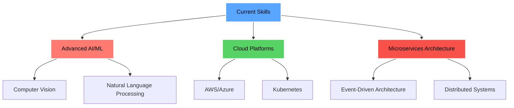

# <div align="center">


</div>

<div align="center">
  
[](https://git.io/typing-svg)

</div>

<div align="center">
  
</div>

---

## &nbsp;**About Me**


```typescript
const fajar = {
  name: "Fajar Geran Arifin",
  role: "Fullstack Developer",
  education: "Informatics Engineering @ Universitas Siliwangi",
  currentFocus: ["Web Development", "Cybersecurity", "AI/ML"],
  workingAt: "PT. Padud Jaya (Intern)",
  
  dailyOS: ["Ubuntu", "Kali Linux"],
  hobbies: ["Video Editing", "Anime (K-ON!)", "Osu! Rhythm Games"],
  
  getCurrentStatus: () => "Building secure & intelligent applications 🚀"
};
```

<details>
<summary><b>🎯 My Journey & Goals</b></summary>
<br>

🌟 **Current Focus Areas:**
- **Web Development**: Creating responsive, performant applications
- **Cybersecurity**: Researching vulnerabilities and building secure systems  
- **AI/ML**: Exploring computer vision and intelligent automation
- **DevOps**: Containerization and deployment strategies

🚀 **What I'm Working On:**
- Production-grade applications for the tobacco industry
- AI-powered garbage detection system
- Open-source contributions to developer tools

</details>

---

## 🚀 **Featured Projects**

<div align="center">
  
[](https://github.com/grnlogic)

</div>

### 🤖 **Garbage Detection AI**
> AI-powered waste detection and classification system

<div align="center">
  
  
</div>

**🎯 Features:**
- Custom trained AI model for waste classification
- Real-time image processing and analysis
- RESTful API with Django backend
- Docker containerization for easy deployment

**🛠️ Tech Stack:**
<div align="center">
  
  
  
  
  
</div>

---

### 📈 **Sales & Operations Reporting System**
> Enterprise-grade reporting solution for business operations

<div align="center">
  
  
</div>

**🎯 Features:**
- Role-based access control (RBAC)
- Real-time sales analytics and reporting
- JWT authentication & authorization
- Self-managed VPS deployment

**🛠️ Tech Stack:**
<div align="center">
  
  
  
  
</div>

---

## 💻 **Tech Arsenal**

<div align="center">

### **Languages & Frameworks**


### **Styling & Design**


### **Databases & Backend**


### **DevOps & Tools**


### **Operating Systems**


</div>

---

## 📊 **GitHub Analytics**

<div align="center">
  


</div>

<div align="center">
  
[](https://git.io/streak-stats)

</div>

<div align="center">
  
[](https://github.com/ryo-ma/github-profile-trophy)

</div>

<div align="center">
  


</div>

---

## 🎯 **Current Learning Path**

<div align="center">
  


</div>

---

## 🤝 **Let's Connect & Collaborate!**

<div align="center">
  
### *"Code is like humor. When you have to explain it, it's bad." – Cory House*

<p>
  <strong>Looking for collaboration opportunities, interesting projects, or just want to chat about tech? Let's connect!</strong>
</p>

[](https://www.linkedin.com/in/fajar-arifin-ab8645362/)
[](mailto:237006079@student.unsil.ac.id)
[](https://www.instagram.com/supra.y1/)
[](https://x.com/geran56033)

</div>

<div align="center">
  
### 🎮 **Fun Fact**
*When I'm not coding, you'll find me watching K-ON!, perfecting my Osu! gameplay, or editing the next viral video! 🎬*

</div>

---

<div align="center">
  


<br/>

**⭐ From [grnlogic](https://github.com/grnlogic) | Made with ❤️ and lots of ☕**


</div>
